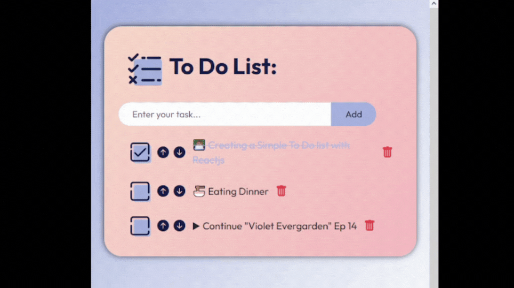

# 📝 To Do List

A clean, intuitive task management application built with React.

## ✨ Features

- **Task Management** : Add, delete, and reorder tasks with simple interactions
- **Priority Control** : Move tasks up or down to adjust their priority level
- **Completion Tracking** : Mark tasks as done/undone with visual feedback
- **Local Data Persistence** : Tasks are stored and managed via a local JSON server

## 🛠️ Tech Stack

- **React** : Frontend library for building the user interface
- **JSON Server** : Mock backend for local data persistence and API simulation
- **Bootstrap** : Primary styling framework for responsive layout and components
- **CSS** : Custom styles for personalized UI enhancements

## 🚀 Getting Started

### Prerequisites
- Node.js (v18 or higher)
- npm or yarn package manager

### Installation

1. **Clone the repository**
   ```bash
   git clone https://github.com/your-username/todo-list.git
   cd todo-list
   
2. **Install dependencies**
   ```bash
   npm install

3. **Start the JSON Server in a separated terminal**
   ```bash
   npm json-server --watch data/db.json --port 8000

4. **Start the React application**
   ```bash
   npm run dev
   
5. **Open the browser and navigate to the link shown on your terminal**
   (or Ctrl + click on the link)

##

## 📸Preview

##

## 📌Key Learning Outcomes

Building this project deepened my understanding of:
  - **RESTful API integration** : (GET, POST, DELETE operations)
  - **Bootstrap utility classes** : for efficient, responsive styling
  - **Debugging** and **error handling** strategies in React applications
  - **Local** development server **setup** and **configuration**

## 🔮 Future Enhancements

- **Task Editing & Organization**: In-place editing, categories, and tagging for better workflow
- **Smart Features** : Due dates, reminders, and automated trash cleanup
- **User Experience** : Export/import functionality and user authentication

## 🛠️ Development Tools

- **Prettier** : Code formatting and consistency
- **React DevTools** : Component inspection and debugging  
- **Git** : Version control

